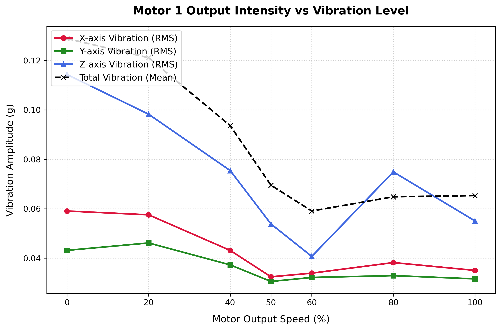
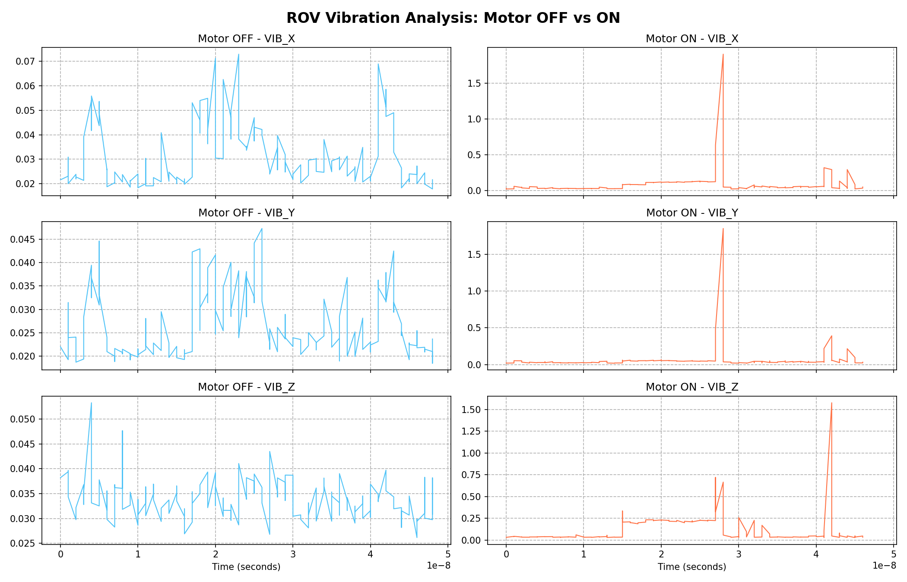

# ROV 추진기 진동 특성 분석 시스템

## 1. 프로젝트 개요

수중 로봇(ROV)의 추진기(Thruster)에서 발생하는 진동 특성을 정량적으로 분석하기 위한 실험 환경을 구축하였다.

기존에는 QGroundControl에서 모터를 수동으로 조작하면서 진동을 측정하였으나, 출력 조건 재현이 어렵고 실험자 개입에 따라 데이터가 달라지는 문제가 존재하였다.

따라서 Pixhawk 기반 모터 제어, Raspberry Pi 기반 데이터 수집, MAVLink 통신, 자동 로그 저장, 자동 데이터 분석까지 하나의 시스템으로 구성하여 반복 가능한 실험 환경을 구축하는 것을 목표로 하였다.

## 2. 시스템 구성

### 하드웨어
- Pixhawk 2.4.8 PRO Clone (ArduSub 4.5.7)
- Raspberry Pi 4B (Debian Trixie Lite 64bit)
- BLDC 모터 x6 + 30A ESC x6
- USB Webcam

### 통신 구조
PC (QGroundControl)

↕ USB

Pixhawk (ArduSub)

↕ UART TELEM2 (921600 baud / MAVLink2)

Raspberry Pi 4B

↕ WiFi (Flask HTTP :8080)

브라우저 대시보드
## 3. 주요 구현 내용

### Pixhawk 초기 세팅
- ArduSub 펌웨어 설치
- IMU / Accelerometer / Compass Calibration
- Frame 설정 (BlueROV2/Vectored)
- Motor Test 및 ESC Calibration
- Safety 설정

### Raspberry Pi ↔ Pixhawk MAVLink 통신
- UART 활성화 / Bluetooth 비활성화 / ttyAMA0 설정
- pymavlink 기반 MAVLink 수신
- ATTITUDE, VIBRATION, SERVO_OUTPUT_RAW, SYS_STATUS 등 실시간 수신

### 실시간 웹 대시보드
- Flask + Three.js + Chart.js 기반
- 3D 자세 시각화 (Roll/Pitch/Yaw)
- 실시간 그래프 (자세각, 진동)
- 모터 배치도 및 PWM 상태 표시
- 이상징후 경고 시스템
- USB 웹캠 실시간 스트리밍

### MAVLink 기반 자동 PWM 제어
- Python + pymavlink로 Pixhawk에 직접 PWM 명령 송신
- 1100 ~ 1900 PWM 단계별 자동 제어

## 4. 진동 실험 및 분석

### 실험 방식 표준화
- 기존: 사람이 슬라이더를 임의 조작 → 조건 재현 불가
- 개선: PWM 단계별(0%, 20%, 40%, 50%, 60%, 80%, 100%) 자동 제어

### 진동 분석 기준
- RMS(Root Mean Square) 기반 진동 세기 평가
- X/Y/Z축 각각 RMS 계산 후 전체 평균으로 진동 지표 정의

### 실험 결과





- 출력 증가에 따라 진동이 단순 증가하지 않고 특정 구간에서 감소/증가하는 특성 관찰
- Z축 진동이 전체 진동 특성에 가장 큰 영향
- 50~60% 출력 부근에서 진동이 가장 낮아지는 경향
- 80% 부근에서 다시 증가 (공진 또는 구조적 진동 특성 가능성)

## 5. 파일 구성

| 파일 | 설명 |
|------|------|
| dashboard_server.py | Flask 기반 메인 서버 |
| dashboard.html | 대시보드 UI |
| vib_logger.py | 진동 데이터 CSV 로거 |
| vibration_analysis.py | 진동 분석 스크립트 |
| plot_vib.py | RMS 기반 자동 분석 및 그래프 생성 |
| vib_log_*.csv | 진동 실험 데이터 |
| motor1_vibration_trend.png | 모터 출력별 진동 RMS 그래프 |
| vib_analysis.png | 모터 OFF/ON 진동 비교 그래프 |

## 6. 실행 방법

```bash
# 대시보드 실행
python3 dashboard_server.py
# 브라우저: http://192.168.0.42:8080

# 진동 로깅
python3 vib_logger.py

# 진동 분석
python3 plot_vib.py
```

## 7. 결론 및 의의

- Pixhawk + Raspberry Pi 기반 ROV 제어 환경 구축
- MAVLink 기반 자동 PWM 제어 시스템 구현
- 반복 가능한 표준화 실험 환경 설계
- RMS 기반 정량적 진동 분석 기법 적용
- Python 기반 자동 분석 프로그램 개발
- 향후 추진기 상태 진단 및 이상 탐지 연구 기초 데이터 확보
